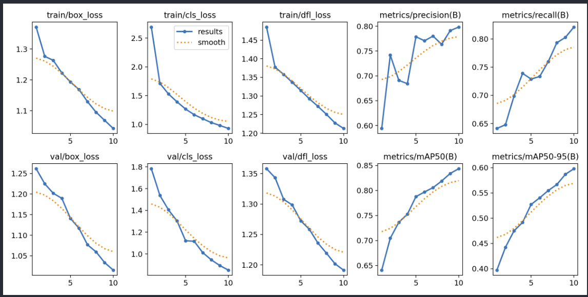

# VAULT MVP - Virtual Try-On System with YOLO and Neural Radiance Fields

## Overview
This project implements a virtual try-on system that combines YOLO object detection with Neural Radiance Fields (NeRF) for BASIC 3D clothing visualization. The system allows users to virtually try on clothing items by capturing them with a camera and rendering them onto a 3D body model.

### Training Performance Analysis

The training plot shows the model's learning progression over 10 epochs. Here are the key observations:

1. **Loss Curves**:
   - Box Loss (Detection):
     * Training box_loss decreases steadily from ~1.35 to ~1.05
     * Validation box_loss follows a similar trend from ~1.25 to ~1.02
   - Classification Loss:
     * Training cls_loss shows significant improvement from ~2.5 to ~0.9
     * Validation cls_loss mirrors this improvement from ~1.8 to ~0.85
   - DFL Loss:
     * Both training and validation dfl_loss show consistent decrease

2. **Metrics Performance**:
   - Precision(B) increases from ~0.60 to ~0.80
   - Recall(B) shows strong improvement from ~0.65 to ~0.82
   - mAP50(B) demonstrates steady growth from ~0.65 to ~0.85
   - mAP50-95(B) improves from ~0.40 to ~0.60

3. **Overfitting Assessment**:
   - No significant overfitting is observed as:
     * Validation losses consistently follow training losses
     * The gap between training and validation metrics remains stable
     * Performance metrics show continuous improvement
   - The smooth curves (dotted orange lines) indicate stable learning

4. **Model Selection**:
   - Optimal checkpoint appears to be at epoch 10
   - No early stopping needed as the model continues to improve
   - Both training and validation metrics show upward trends without divergence

### Conclusion
The model demonstrates healthy training characteristics with:
- Consistent learning across all metrics
- No signs of overfitting
- Strong final performance metrics (mAP50 > 0.80)
- Room for potential further improvement beyond 10 epochs

## Features
- Real-time clothing detection using YOLO
- 3D body mesh generation with customizable parameters
- Neural Radiance Field-based clothing rendering
- Interactive virtual try-on experience
- Support for multiple clothing items
- GPU acceleration when available

